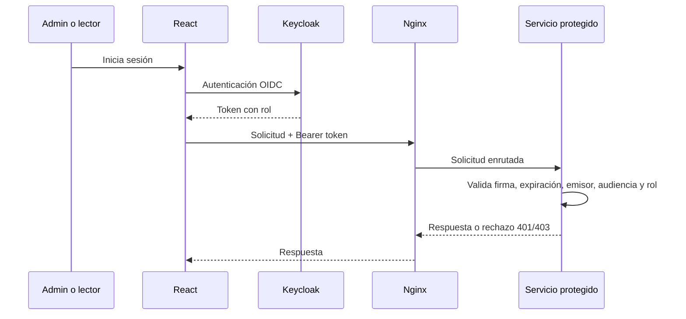

# Arquitectura lógica y de seguridad

## Componentes aprobados

| Componente | Responsabilidad | Acceso |
| --- | --- | --- |
| React | Interfaz de administración, consulta y tickets | Admin y lector |
| Nginx | Entrada única y proxy inverso | Público |
| Keycloak | Identidad, roles `admin`/`lector` y clientes técnicos | Login y administración restringida |
| Device service | Inventario y estado de dispositivos | Admin escribe; lector consulta |
| Telemetry service | Lecturas enviadas por simulador | Simulador publica; usuarios consultan según rol |
| Alert-ticket service | Umbrales, alertas y tickets no críticos | Admin gestiona; lector crea/consulta tickets |
| Report service | Resúmenes y reportes autorizados | Admin completo; lector limitado |
| PostgreSQL | Persistencia interna | Solo servicios |

## Flujo principal

## Controles mínimos a implementar

- Las credenciales no se almacenan ni transmiten en texto plano.
- El recurso protegido verifica autenticación y autorización; no debe confiar solo en la interfaz o el gateway.
- Las credenciales tendrán vigencia limitada y se validarán emisor, audiencia, firma y expiración cuando el mecanismo elegido lo permita.
- Los secretos se configurarán por variables de entorno y nunca se versionarán.
- Las respuestas de error no expondrán secretos ni información innecesaria.
- Se registrarán eventos de autenticación y rechazo sin almacenar contraseñas o tokens completos.

## Decisiones adoptadas

FastAPI/Python 3.11, React/Vite, Keycloak OAuth 2.0/OIDC, RBAC con roles `admin` y `lector`, Nginx, PostgreSQL y Docker Compose. La primera versión usa HTTP local para desarrollo; HTTPS/TLS será una mejora documentada para despliegue real.

## Diagramas que faltará elaborar

Antes de implementar: arquitectura general, componentes, comunicación, flujo de información y despliegue. Este documento contiene solo el boceto lógico inicial.
