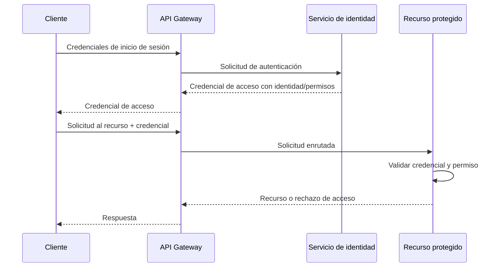

# Arquitectura lógica y de seguridad

## Componentes

| Componente | Responsabilidad | Exposición prevista |
| --- | --- | --- |
| Cliente de prueba | Iniciar sesión y solicitar recursos | Externo |
| API Gateway | Punto de entrada, enrutamiento y controles transversales | Público |
| Servicio de identidad | Verificar credenciales y emitir/gestionar la identidad de acceso | Interno o mediante gateway |
| Servicio de recurso protegido | Aplicar autorización y devolver el recurso de prueba | Interno o mediante gateway |

## Flujo propuesto

## Controles mínimos a implementar

- Las credenciales no se almacenan ni transmiten en texto plano.
- El recurso protegido verifica autenticación y autorización; no debe confiar solo en la interfaz o el gateway.
- Las credenciales tendrán vigencia limitada y se validarán emisor, audiencia, firma y expiración cuando el mecanismo elegido lo permita.
- Los secretos se configurarán por variables de entorno y nunca se versionarán.
- Las respuestas de error no expondrán secretos ni información innecesaria.
- Se registrarán eventos de autenticación y rechazo sin almacenar contraseñas o tokens completos.

## Decisiones pendientes

No se ha decidido aún: lenguaje/framework, JWT frente a OAuth 2.0/OIDC, proveedor de identidad, base de datos, protocolo concreto, uso de TLS local, contenedores, observabilidad ni despliegue. Registrar cada decisión y su motivo en [tecnologias.md](tecnologias.md).

## Diagramas que faltará elaborar

Antes de implementar: arquitectura general, componentes, comunicación, flujo de información y despliegue. Este documento contiene solo el boceto lógico inicial.
